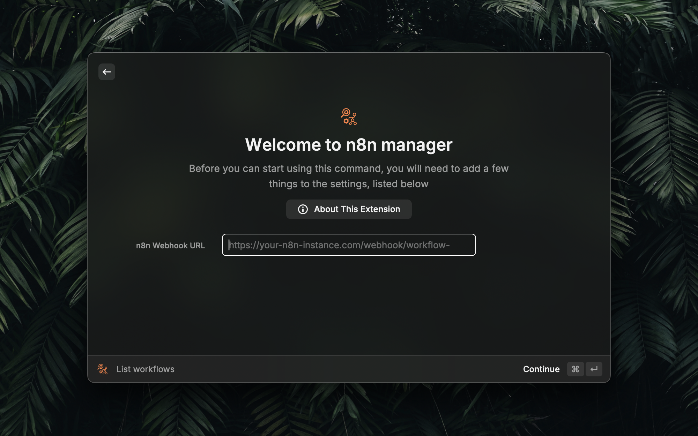
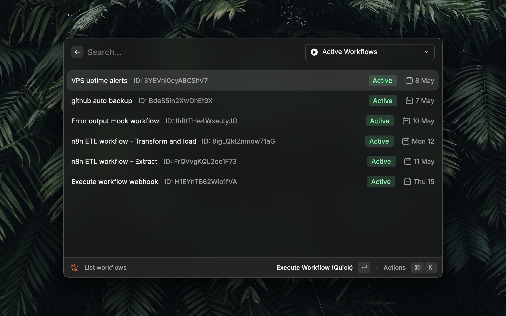
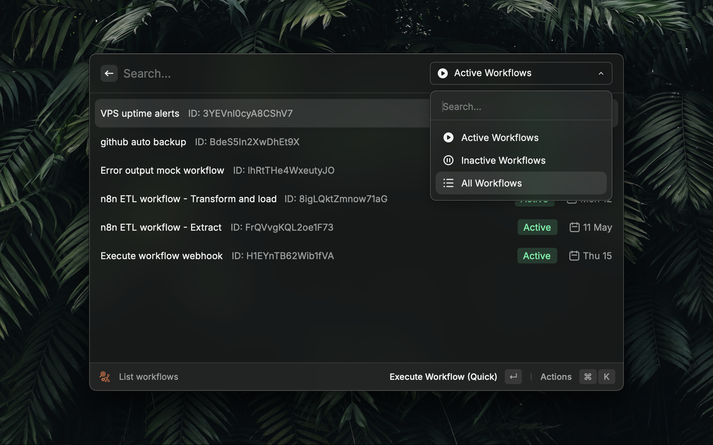
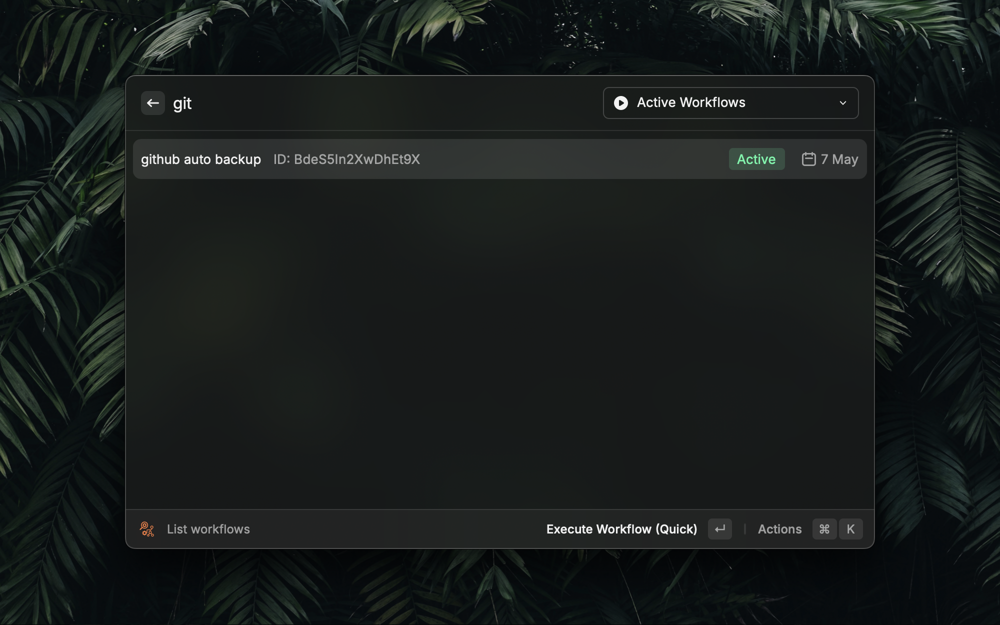
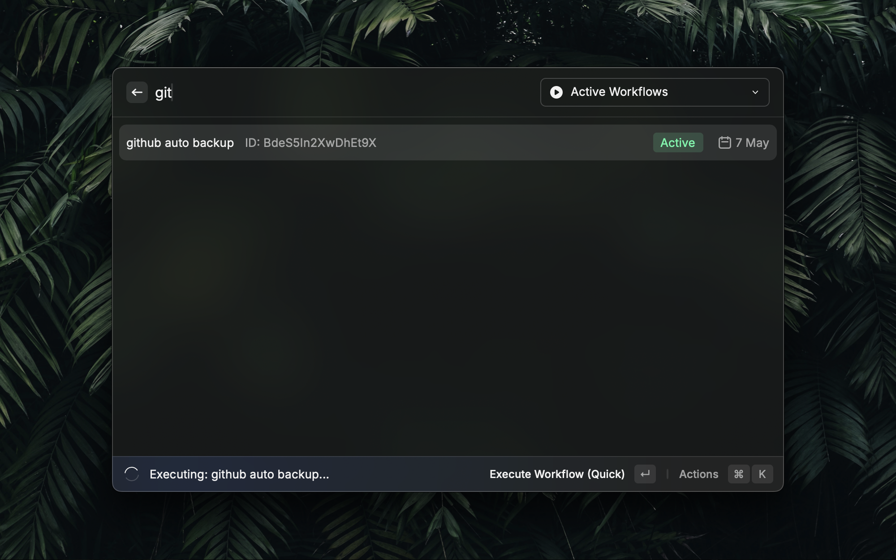
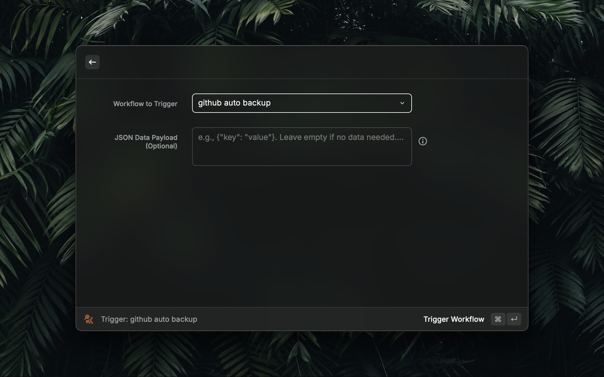
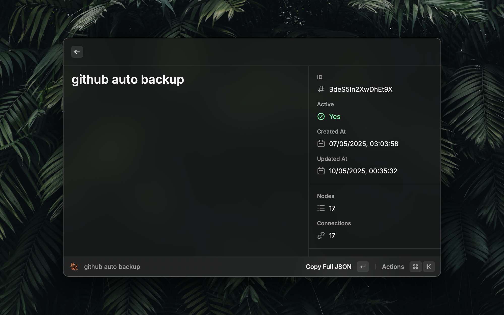

# n8n Manager for Raycast

> Search and execute n8n workflows directly from Raycast

## What is n8n Manager?

n8n Manager is a Raycast extension that lets you interact with your n8n.io workflows directly from the Raycast command bar. Search, filter, execute, and inspect your n8n workflows with speed and ease. It requires a companion workflow (installation detailed below) on your n8n instance to enable these management capabilities.

## Features

- **Search**: Quickly find workflows by name or ID
- **Filter**: View active, inactive, or all workflows
- **Execute**: Run workflows with or without data
- **Inspect**: View detailed information about workflows
- **Copy**: Copy workflow IDs or JSON data for easy reference

## Requirements

- [Raycast](https://www.raycast.com/) installed
- A running [n8n](https://n8n.io/) instance
- A special workflow in your n8n instance (see below)

## Installation

### 1. Install the Workflow Manager Workflow in n8n

This extension requires a special workflow in your n8n instance:

1. Log into your n8n instance
2. Import the [workflow-manager.json](n8n-workflow/workflow-manager.json)
   _Note: Template is under review at n8n, as soon as its available as a template, this link will be updated_
3. Configure the workflow by following the instructions from the sticky notes
4. Activate the workflow and note the webhook URL

### 2. Install the Raycast Extension

1. Open Raycast
2. Go to Store
3. Search for "n8n Manager"
4. Click Install
5. Configure the extension with your n8n webhook URL and API token

## Configuration

### Settings Explained

- **n8n Webhook URL**: The full URL of your workflow manager webhook (e.g., `https://n8n.yourdomain.com/webhook/workflow-manager`)
  _! make sure you copy the *production* webhook url_
- **n8n API Bearer Token**: The token for authentication with your n8n instance

### Security

The API uses a Bearer token authentication.
_! make sure to chose a strong key for it_

## Usage

### First use

If you use the extension for the first time, you will be asked for a webhoook url and a Bearer key:

### Searching and Filtering Workflows

The `list workflows` command by default shows all active workflows:

Inactive workflows can be listed from the dropdown:

Workflows can be searched by both name and id:

### Executing Workflows

#### Quick Execute

THis is the default action for workflows; the action assumes no mandatory input for execution

#### Execute with JSON

If workflows need specific input to be executed, this input can be provided in json format from this action
_Note: a better way of handling those kinds of workflows is on the roadmap_

### Viewing Workflow Details

Workflows can also be inspected within raycast with this action; the provided info will be enhanced in the comming weeks

## Roadmap

Upcoming features:

- Workflow caching for faster loading times
- Pagination for large workflow collections
- Execution history tracking
- Support for workflow parameters

## For Developers

### Project Documentation

This project includes detailed documentation about its structure and code conventions:

- [Project Structure](docs/project-structure.md) - Overview of the directory structure and layer responsibilities
- [Code Conventions](docs/code-conventions.md) - Coding principles and standards used in this project

### Development Setup

Instructions for setting up the development environment:

1. Clone the repository
2. Install dependencies with `pnpm install`
3. Configure your dev environment
4. Start development with `pnpm dev`

## License

MIT
